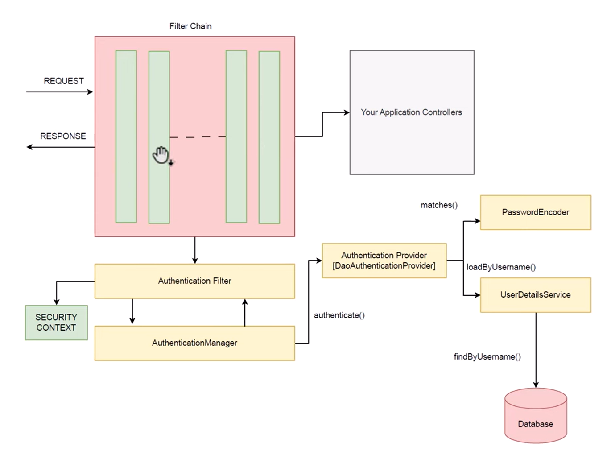
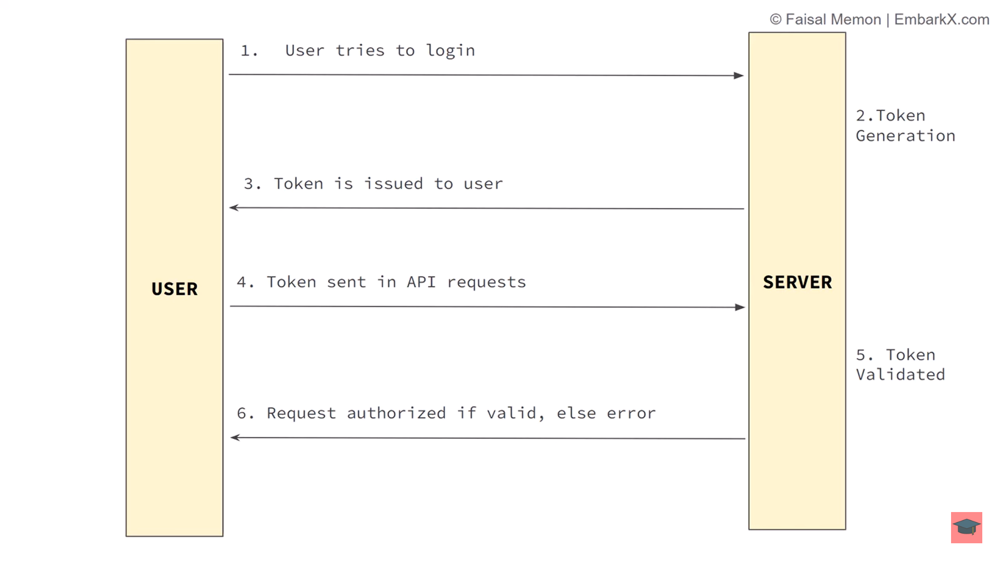

## Spring Security

### Importance:
 - Privacy Protection: Unauthorized person should not see your personal data
 - Trust: User and client will trust if your security is strong
 - Integrity: Data remains unchanged and trustworthy preventing unauthorized modification
 - Compliance: Security helps ensure compliance with laws avoiding legal consequence

### Spring Ecosystem
 - Spring Framework
 - Spring Boot
 - Spring Data
 - Spring Security
    * Authentication
    * Authorization

### Authentication vs Authorization
 * #### Authentication: It's like proving "Who you are"
        e.g: You're entering a hotel and security guard
        checks your ID card and let you enter because
        you're member of that hotel.

 * #### Authorization: It's about "What you're allowed to do" after you proved who you are
        e.g: You entered the hotel showing ID card but
        you're not allowed to enter security zone as
        you're not authorized to do so. but you can enter
        to a party hall if you're authoorized.

### Key Security Principle
1. **Least privilege:** user should have minimum level of access or permission that you should assign to perform necessary task
2. **Secure by Design:** you have to think about the security into the design phase itself
3. **Fail-Safe Defaults:** in the event of a failure or error, the system defaults to a secure state rather than an insecure one. This principle is aimed at minimizing the risk of unauthorized access or damage when something goes wrong.
   - **`Default Denial of Access:`** By default, access to resources should be denied unless explicit permission is granted. This ensures that accidental or unauthorized access is prevented
   - **`Secure Failure:`** If a system component fails, it should do so in a way that does not compromise security. For instance, if a firewall fails, it should block all traffic rather than allow all traffic.
4. **Secure Communication:** Protect secure information while transmission of data (Encryption and Decryption)
5. Input Validation: Input data from external api and all should be validated to prevent attack like `SQL Injection`
6. Auditing and Logging: To record the events related to security and all the action that have been performed by your system
7. Regular updates and Patch Management: security dependencies should be updated with the latest version because the previous vulnerabilities have been fixed


### How Spring security Works

* when request comes in, it goes through multiple layer of Filter Chain before reaching to Controller
* Authentication filter is one layer of them (if your project has authentication configured)
* Will understand rest of the flow on the way

### Authentication Type

#### 1. Form based authentication: 
   When you add spring security dependency in your project, following thing will happen
   - All endpoint except /login will be authenticated
   - when you try to access any end point, a login form will be presented (which is default by spring security)
   - It will also generate a test user with username=`user` and a random password will be printed on console that you can use to log in and access any end point
   - It also generates /logout end point that is used to log out
   - you can set demo user and password in yaml file as shown below
      ```yaml
     spring:
       security:
         user:
            name: demoUser
            password: demo@123
     ```
<br>

#### 2. Basic authentication:
```java
    @Deprecated
    @Configuration
    @EnableWebSecurity
    public class SecurityConfig {
        @Bean   
        SecurityFilterChain defaultSecurityFilterChain(HttpSecurity http) {
            http.authorizeRequests().anyRequest().authenticated();
            http.formLogin().disable(); //DEPRECATED AND REMOVED IN LATEST VERSION
            http.httpBasic(); //DEPRECATED AND REMOVED IN LATEST VERSION
            return http.build();
        }
    }
```
   * It provides you alert dialog to enter user id and password
   * /login, /logout endpoint will not be generated
   * userName:password is encoded in Base64
   * you can make it stateless by:
```java
      @Deprecated
      @Configuration
      @EnableWebSecurity
      public class SecurityConfig {
         @Bean   
         SecurityFilterChain defaultSecurityFilterChain(HttpSecurity http) {
            http.authorizeRequests().anyRequest().authenticated();
            //adding this
            http.sessionManagement(session ->
                    session.sessionCreationPolicy(SessionCreationPolicy.STATELESS));
            http.formLogin().disable(); //DEPRECATED AND REMOVED IN LATEST VERSION
            http.httpBasic(); //DEPRECATED AND REMOVED IN LATEST VERSION
            return http.build();
         }
      }
```
<br>

#### 3. In Memory Authentication
```java
@Configuration
@EnableWebSecurity
public class SecurityConfig {
    @Bean
    SecurityFilterChain defaultSecurityFilterChain(HttpSecurity http) throws Exception {
        http.authorizeRequests().anyRequest().authenticated();
        http.sessionManagement(session ->
                session.sessionCreationPolicy(SessionCreationPolicy.STATELESS));
        http.formLogin().disable();
        http.httpBasic();
        return http.build();
    }


   /**
    * Create a bean to add as many user you want
    * this is not saved in data. but will work for testing purpose
    */
    @Bean
    UserDetailsService userDetailsService(){
        UserDetails user1 = User.withUsername("user1")
                .password("{noop}password1") // {noop} is for not encode password for now
                .roles("USER")
                .build();

        UserDetails admin = User.withUsername("admin")
                .password("{noop}admin") // {noop} is for not encode password for now
                .roles("ADMIN")
                .build();
        return new InMemoryUserDetailsManager(user1, admin);
    }
}
```
   * works like basic authentication
   * you just have to provide credential as you've created

<br>

#### 4. Role Based Authentication
   Role based means different user will have different role and your role will authorize to access some endpoints
```java
//Create different endpoints in controller
// to provide access based on role
@RestController
public class HelloController {

   @PreAuthorize("hasRole('ADMIN')") //this to work, enable method security in Config
   @GetMapping("/admin/hello")
   public String sayHelloAdmin(){
      return "Hello Admin";
   }


   @PreAuthorize("hasRole('USER')") //this to work, enable method security in Config
   @GetMapping("/user/hello")
   public String sayHelloUser(){
      return "Hello User";
   }
}
```
now enable method security in config file
```java
@Configuration
@EnableWebSecurity
@EnableMethodSecurity //add this
public class SecurityConfig {
    @Bean
    SecurityFilterChain defaultSecurityFilterChain(HttpSecurity http) throws Exception {
        http.authorizeRequests().anyRequest().authenticated();
        http.sessionManagement(session ->
                session.sessionCreationPolicy(SessionCreationPolicy.STATELESS));
        http.formLogin().disable();
        http.httpBasic();
        return http.build();
    }


    @Bean
    UserDetailsService userDetailsService(){
        UserDetails user1 = User.withUsername("user1")
                .password("{noop}password1") // {noop} is for not encode password for now
                .roles("USER")
                .build();

        UserDetails admin = User.withUsername("admin")
                .password("{noop}admin") // {noop} is for not encode password for now
                .roles("ADMIN")
                .build();
        return new InMemoryUserDetailsManager(user1, admin);
    }
}
```
   * `/user/hello` is only accessed by USER otherwise error 403 forbidden
   * `/admin/hello` is only accessed by ADMIN otherwise error 403 forbidden

#### 5. (Database) Authentication
```java
@Configuration
@EnableWebSecurity
@EnableMethodSecurity
@RequiredArgsConstructor
public class SecurityConfig {
    private final DataSource dataSource;
    
    @Bean
    SecurityFilterChain defaultSecurityFilterChain(HttpSecurity http) throws Exception {
        http.authorizeRequests().anyRequest().authenticated();
        http.sessionManagement(session ->
                session.sessionCreationPolicy(SessionCreationPolicy.STATELESS));
        http.formLogin().disable();
        http.httpBasic();
        return http.build();
    }


    @Bean
    UserDetailsService userDetailsService(){
        UserDetails user1 = User.withUsername("user1")
                .password("{noop}password1") // {noop} is for not encode password for now
                .roles("USER")
                .build();

        UserDetails admin = User.withUsername("admin")
                .password("{noop}admin") // {noop} is for not encode password for now
                .roles("ADMIN")
                .build();

        JdbcUserDetailsManager userDetailsManager = new JdbcUserDetailsManager(dataSource);
        userDetailsManager.createUser(user1);
        userDetailsManager.createUser(admin);
//        return new InMemoryUserDetailsManager(user1, admin);
        return userDetailsManager;
    }
}
```
add database related values in yaml file
```yaml
spring:
  application:
    name: SpringSecurityDemo

  datasource:
    url: jdbc:mysql://localhost:3307/demo
    username: root
    password: root
    driver-class-name: com.mysql.cj.jdbc.Driver

  jpa:
    properties:
      hibernate:
        dialect: org.hibernate.dialect.MySQL8Dialect

    hibernate:
      ddl-auto: update
    show-sql: true
```
<br>

#### 6. JWT based Authentication

   * Login request is sent from user to server with username and password
   * Server will validate credential and generate token if credential is valid. token is returned to the user
   * Next time, any request done by user will be sent with the token, not username and password. Token will give you access to the endpoints if allowed

   Let's see the implementation of JWT token based authentication. <br>
   We'll be creating multiple classes for that.
   1. Add jwt dependency in pom file
      ```xml
      <dependency>
        <groupId>io.jsonwebtoken</groupId>
        <artifactId>jjwt-api</artifactId>
        <version>0.12.6</version>
      </dependency>
      <dependency>
         <groupId>io.jsonwebtoken</groupId>
         <artifactId>jjwt-impl</artifactId>
         <version>0.12.6</version>
         <scope>runtime</scope>
      </dependency>
      <dependency>
         <groupId>io.jsonwebtoken</groupId>
         <artifactId>jjwt-jackson</artifactId> <!-- or jjwt-gson if Gson is preferred -->
         <version>0.12.6</version>
         <scope>runtime</scope>
      </dependency>
      ```
   2. `JwtUtil.java` class : contains utility methods for generating, validating and parsing JWTs
       ```java
        @Component
        public class JwtUtil {
    
            private static final Logger logger = LoggerFactory.getLogger(JwtUtil.class);
    
            @Value("app.jwt.jwtSecret") // value is assigned in properties or yaml file
            private String jwtSecret;
    
            @Value("app.jwt.jwtExpirationMS") // value is assigned in properties or yaml file
            private long jwtExpirationMS;
    
            /**
                will fetch the jwt token from header of any request
            */
            public String getJwtFromHeader(HttpServletRequest request){
                String bearerToken = request.getHeader("Authorization");
                logger.info("bearer token from header: {}", bearerToken);
                if(bearerToken != null && bearerToken.startsWith("Bearer ")){
                    return bearerToken.substring(7);
                }
                return null;
            }

            /**
                will generate token using username and secret key, will set expiration
            */
            public String generateTokenFromUserName(UserDetails userDetails){
                String userName = userDetails.getUsername();
                return Jwts.builder()
                    .subject(userName)
                    .issuedAt(new Date())
                    .expiration(new Date(new Date().getTime() + jwtExpirationMS))
                    .signWith(getKey())
                    .compact();
            }

            private Key getKey(){
                return Keys.hmacShaKeyFor(Decoders.BASE64.decode(jwtSecret));
            }

            /**
                will parse username from token
            */
            public String getUserNameFromToken(String token){
                return Jwts.parser()
                    .verifyWith((SecretKey) getKey())
                    .build()
                    .parseSignedClaims(token)
                    .getPayload()
                    .getSubject();
            }

            /**
                will return true if token is valid else false or will throw Exception if any
            */
            public boolean validate(String token){
                try{
                    Jwts.parser()
                        .verifyWith((SecretKey) getKey())
                        .build()
                        .parseSignedClaims(token);
                    return true;
                } catch (MalformedJwtException e){
                    logger.error("Invalid JWT token: {}", e.getMessage());
                } catch (ExpiredJwtException e){
                    logger.error("JWT token expired: {}", e.getMessage());
                } catch (UnsupportedJwtException e){
                    logger.error("JWT token unSupported: {}", e.getMessage());
                } catch (IllegalArgumentException e){
                    logger.error("JWT claims string is empty: {}", e.getMessage());
                } catch (Exception e){
                    logger.error("Error occurred: {}", e.getMessage());
                }
                return false;
            }

        }
        ```
   3. `AuthTokenFilter.java` class
        * filters incoming request to check for a valid JWT, setting authentication context if token is valid
        * Extracts JWT from request header, validate it, and configures the spring security context with user details is it is valid
   
    

#### YouTube playlist I followed: https://www.youtube.com/watch?v=CTdPnaWmSuY&list=PLxhSr_SLdXGOpdX60nHze41CvExvBOn09

#### Article on medium:
https://medium.com/@nagarjun_nagesh/role-based-authorization-in-spring-boot-e8bc8a88bd00


* ### Roles and Authorities:

  Roles are high-level groupings that represent a set of authorities. Authorities, in turn, define the specific permissions granted to users with a certain role.

